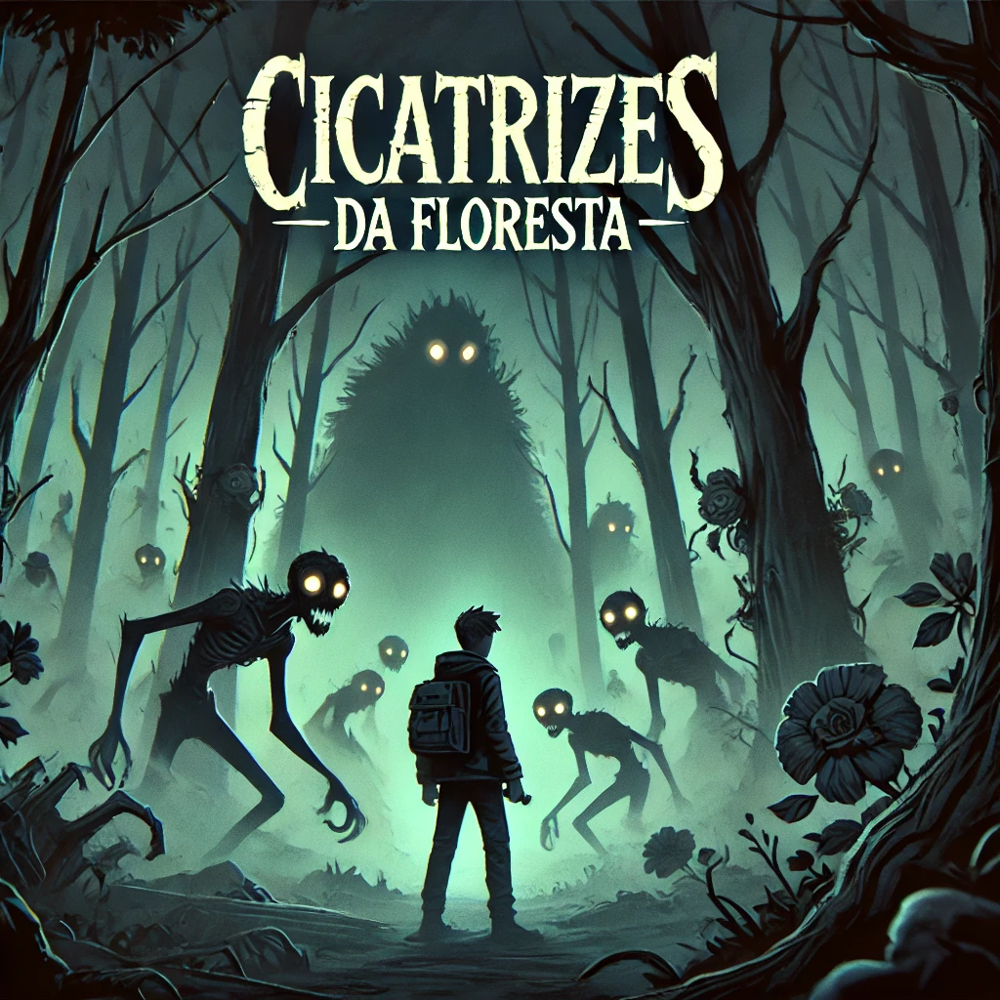

# Cicatrizes da Floresta 🌲🩹  
*"Cada escolha deixa uma marca. Algumas cicatrizes nunca curam."*  

## 📌 Capa do Jogo  


## 🎮 Sobre o Jogo  
**Cicatrizes da Floresta** é um jogo de escolhas narrativas onde suas decisões moldam não apenas o destino do personagem, mas também o próprio ambiente.  
Ao desvendar enigmas e enfrentar criaturas sobrenaturais, você descobrirá que a floresta guarda memórias de todos que já se perderam nela.  

### Características principais:  
- 🌳 **Sistema de cicatrizes permanentes**: O mundo muda com suas escolhas erradas  
- 🧠 **Enigmas aleatórios** gerados dinamicamente  
- ⚔️ **3 finais únicos** baseados em suas ações  
- 🎭 **Personagem misterioso**: O Guardião das Sombras  

## 🚀 Como Jogar (Acesse [como-jogar.md](docs/como-jogar.md))
1. Clone o repositório:  
   ```bash
   git clone https://github.com/LuanRoccha13/Cicatrizes-da-Floresta.git
   ```
2. Abra `index.html` no navegador  
3. Escolha sabiamente – cada decisão afeta o desfecho  

### Controles:  
- 🖱 **Mouse/Touch**: Selecionar opções  
- 🔄 **F5**: Reiniciar o jogo  

## 🛠️ Tecnologias Usadas  

| Área      | Ferramentas                     |
|-----------|--------------------------------|
| **Frontend** | HTML5, CSS3, JavaScript Vanilla |
| **Design** | Leonardo.AI    |
| **Hosting** | GitHub Pages                  |

## 🌲 Lore do Mundo  
A Floresta de Vedargh não é um lugar comum. Ela cresce a partir das emoções perdidas de viajantes falhos. Árvores retorcidas sussurram segredos, e estátuas antigas testemunham cada erro cometido por aqueles que vieram antes de você.  

### Personagens-chave:  
- **O Guardião**: Entidade que protege os segredos da floresta  
- **A Criatura do Riacho**: Ser que se alimenta de arrependimentos  
- **As Sombras**: Ecos de jogadores passados  

## 📂 Estrutura do Projeto  
```
/cicatrizes-da-floresta
├── /assets                 # Contém imagens e outros arquivos estáticos
│   └── /images             # Imagens usadas no jogo
│       ├── Floresta.jpeg
│       ├── Guardião.jpeg
│       └── Rio.jpeg
├── /src                    # Código-fonte do jogo
│   ├── index.html          # Página principal
│   ├── style.css           # Estilos globais
│   ├── script.js           # Lógica principal do jogo
│   ├── gameData.js         # Dados da narrativa e escolhas
│
├── /docs                   # Documentação do projeto
│   └── como-jogar.md       # Como jogar o jogo, instruções adicionais
├── LICENSE                 # Licença do projeto
└── README.md               # Documentação principal do projeto (README)

```

## 🤝 Como Contribuir  
1. Faça um **fork** do projeto  
2. Crie uma branch:  
   ```bash
   git checkout -b feature/nova-mecanica
   ```
3. Envie um **Pull Request**  

### Regras:  
✔ **Documente novas features no README**  
✔ **Mantenha o estilo de código consistente**  

## 📜 Licença  
Este projeto está sob a licença **MIT** - veja o arquivo `LICENSE` para detalhes.  

**Você pode usar o código livremente, mas deve creditar os autores originais.**  

## ✨ Créditos  
- **Desenvolvimento**: [Luan Rocha da Silva](http://github.com/Luanroccha13), [Caio Dantas Farias](https://github.com/caiodantas04).  
- **Arte**: Feito com [Leonardo.AI](https://leonardo.ai/).  
- **Inspiração**: Jogos como *The Witcher 3* e *Kentucky Route Zero*  

## 🎲 Jogue Online  
Acesse a [demo](https://luanroccha13.github.io/Cicatrizes-da-Floresta/) 

🔮 *"A floresta observa. A floresta lembra."*  

---    
